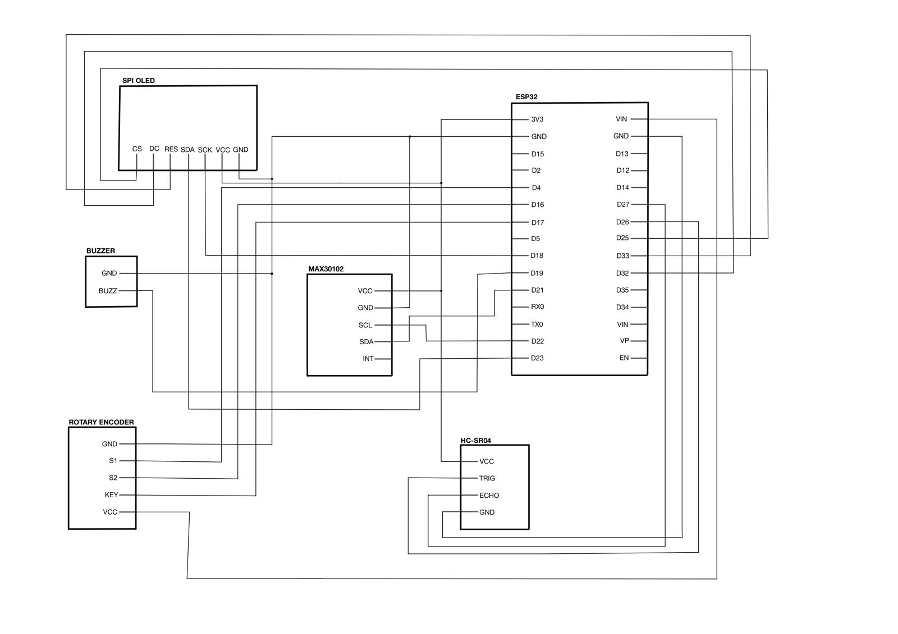
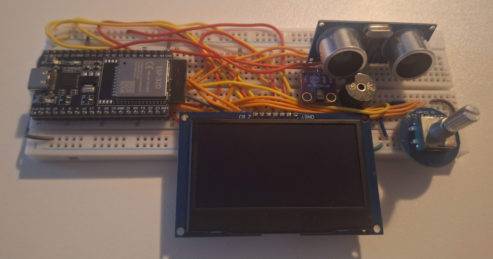
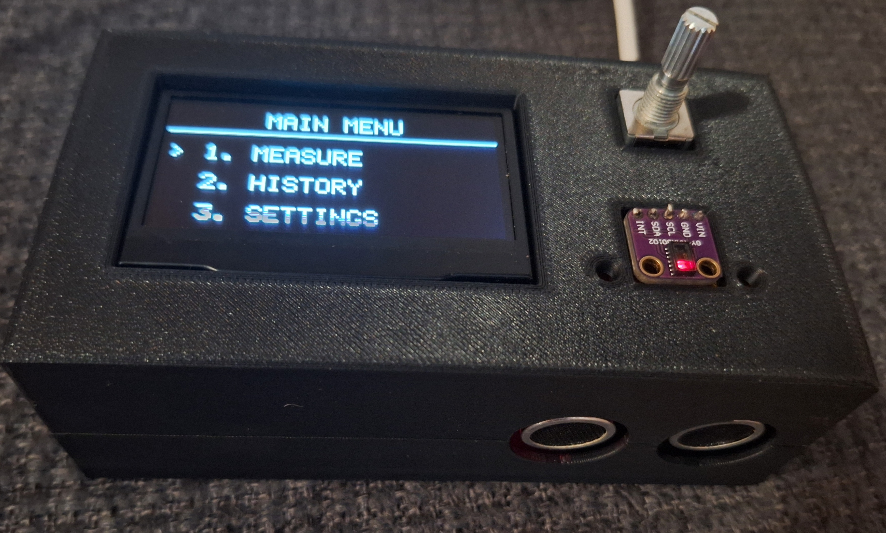
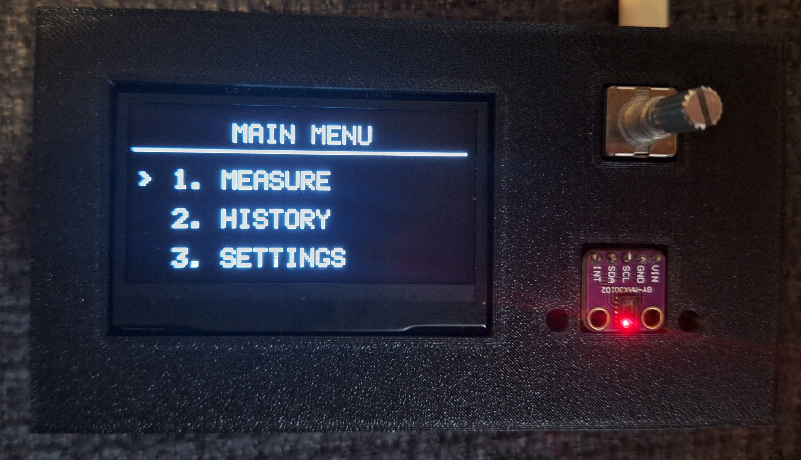
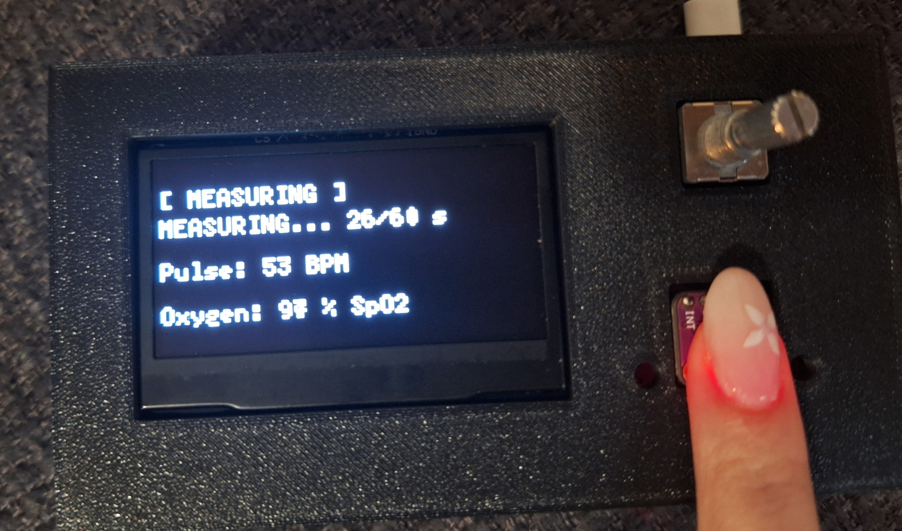
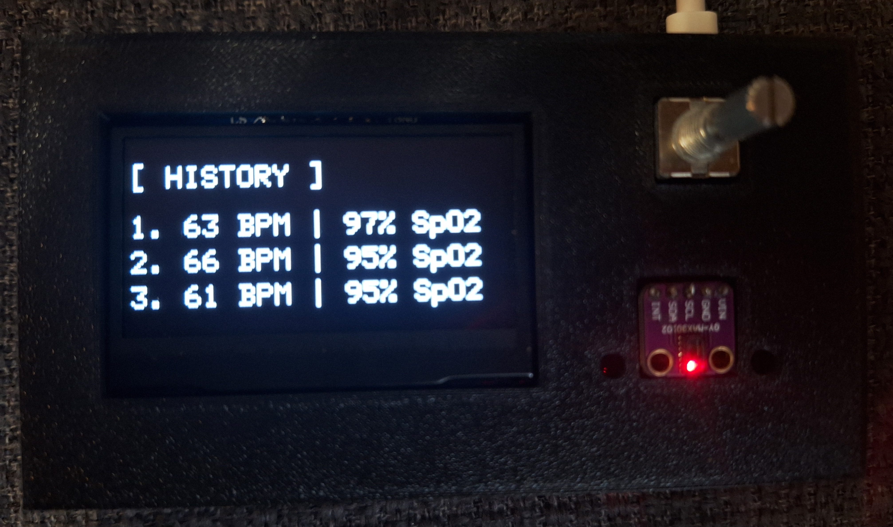
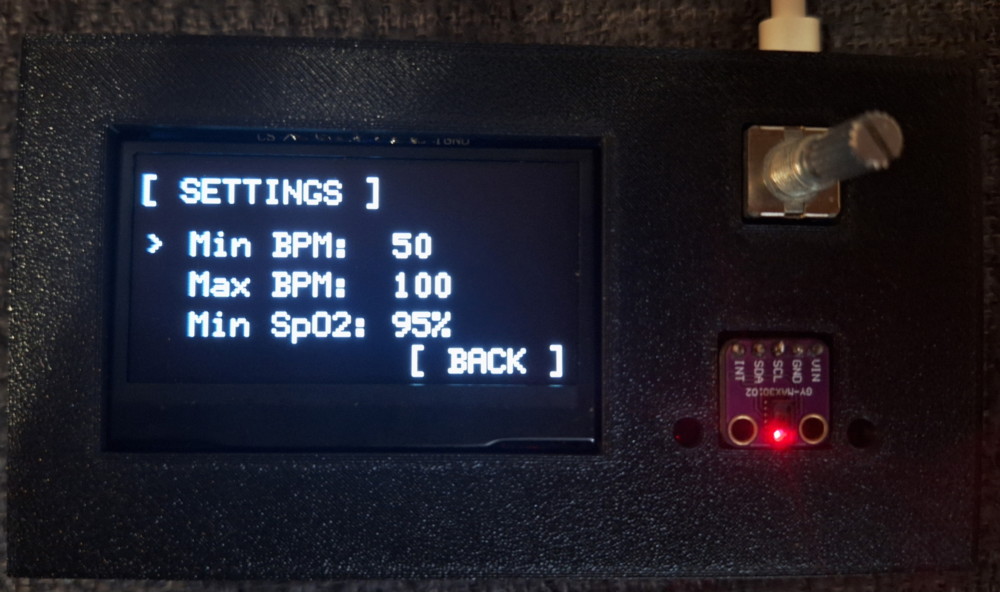

# Smart Health Monitor

## Project Overview

Smart Health Monitor is an ESP32-based project that enables:

- heart rate measurement (BPM)
- blood oxygen saturation measurement (SpO2)
- measurement history storage
- configurable alarm thresholds for minimum/maximum BPM and SpO2 levels
- automatic display shutdown for power saving
- navigation using a rotary encoder

The system uses an OLED display for data visualization and a buzzer for audio alerts.


## Components Used

- ESP32 - Main microcontroller 

- MAX30102 - Heart rate and SpO2 sensor

- OLED SSD1309 128x64 - SPI OLED display

- Rotary Encoder - Menu navigation

- HC-SR04 - Ultrasonic sensor

- Buzzer - Audio alerts

## Scheme

<p align="center">
  
</p>

## Prototype

<p align="center">
  
</p>

## Final product

<p align="center">
  
</p>

## Features

### Main Menu

The main menu contains:

- Measure
- History
- Settings

Navigation is performed using the rotary encoder.

<p align="center">
  
</p>


### Measure

Measurement process:

- the user places a finger on the MAX30102 sensor
- the system measures for 60 seconds
- BPM and SpO2 values are calculated
- results are stored in memory


<p align="center">
  
</p>


If no finger is detected:

```text
STATUS: NO FINGER
Place finger...
```

### History

Displays the last 3 saved measurements.

Data is stored using ESP32 `Preferences` memory.

Some of the measuring results:

<p align="center">
  
</p>


### Settings

The following parameters can be configured:

- minimum BPM
- maximum BPM
- minimum SpO2


<p align="center">
  
</p>


## Alarm System

The buzzer activates when:

- SpO2 drops below the configured limit
- BPM goes outside the defined range

| Situation | Sound |
|---|---|
| Low SpO2 | 2000 Hz |
| Abnormal BPM | 100 Hz |

---

## Power Saving Mode

The ultrasonic sensor detects user presence.

If no activity is detected for 60 seconds:

- the OLED display turns off
- the system enters sleep mode

When the user approaches the device again:

- the display turns back on
- the system resumes operation


## Measurement Method

### BPM

BPM is calculated by detecting peaks in the IR signal.

Formula:

```text
BPM = (beat count * 60) / time
```


### SpO2

SpO2 is approximated using the ratio of AC components from the red and IR signals:

```cpp
float R = (redAC / redValue) / (irAC / irValue);
float calculation = 104 - 17 * R;
```

## Running the Project

 1. Install ESP32 Board Package

 2. Install Libraries

    - MAX30105
    - U8g2

3. Upload the Code
# Authors:
Ivona Pranjić & Marta Dasović, 2025./2026.
## Note

This project is intended for educational purposes only and is not a medically certified device.

Measured values may differ from professional medical equipment.


## Authors

Marta Dasović and Ivona Pranjić

Faculty of Electrical Engineering, Computer Science and Information Technology Osijek
